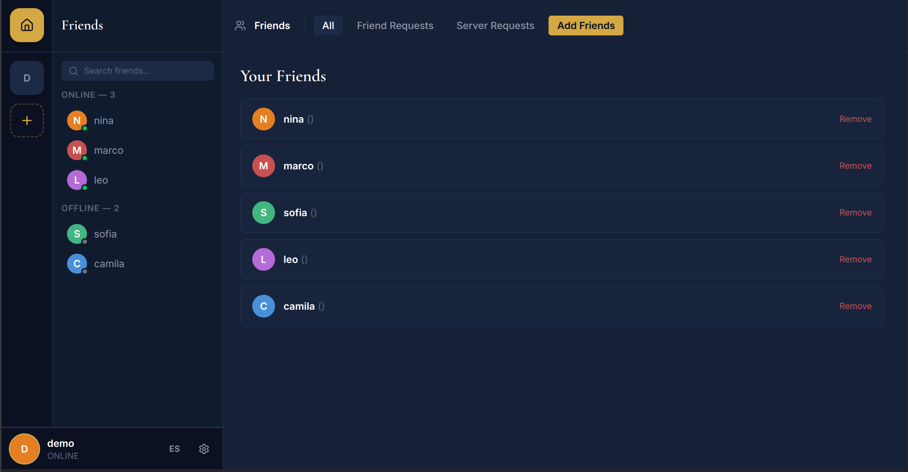
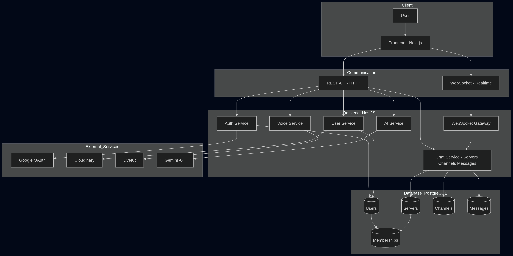

<div align="center">
  

  # Discol

  A Discord-inspired real-time chat app — text channels, voice rooms, friend system, role-based permissions, and a full CI/CD pipeline.

  [](https://github.com/esteban0406/Chat-App/actions/workflows/main.yml)
  
  
  
  
</div>

---

**[Live Demo](https://esteban-discord-clone.duckdns.org)** — Try Demo mode, no signup needed.



---

## Features

- **Real-time messaging** — Messages are delivered instantly via Socket.IO to channel members only — no global broadcasts.
- **Voice & video rooms** — LiveKit-powered audio and video sessions directly inside a channel.
- **Friend system** — Send and accept friend requests with live socket notifications.
- **Server management** — Create servers, invite members, and assign roles with granular permissions.
- **Authentication** — Sign in with email/password or Google OAuth2. JWTs expire after 7 days.
- **Avatar uploads** — Profile pictures stored and served via Cloudinary.
- **Guided demo tour** — An interactive onboarding tour walks new users through the interface step by step.
- **Bilingual UI** — Full English and Spanish localization with automatic browser language detection.

---

## Technical Highlights

**Selective real-time events.** The Socket.IO gateway uses two patterns: channel rooms for message fanout (only users in the active channel receive new messages), and user-specific rooms (`user:<id>`) for private notifications like friend requests and server invites. This avoids the common trap of broadcasting everything to everyone and keeps the real-time layer predictable.

**Role-based access control.** Six permissions — `CREATE_CHANNEL`, `DELETE_CHANNEL`, `INVITE_MEMBER`, `REMOVE_MEMBER`, `MANAGE_ROLES`, and `DELETE_SERVER` — are modeled in the database and enforced through NestJS guards. Server owners bypass checks automatically. This keeps authorization rules visible and in one place rather than scattered across controllers.

**Layered test strategy.** The project has 53 frontend unit tests, 34 backend unit tests, 14 backend integration tests running against a real PostgreSQL instance, and 9 Playwright end-to-end specs covering auth, messaging, friends, servers, roles, and invites. Each layer catches a different class of bug — logic errors, database issues, and broken user flows respectively.

**CI/CD pipeline.** GitHub Actions runs lint, type-check, unit tests, integration tests, and full-stack E2E tests on every pull request. No direct pushes to `main` are allowed — a PR must pass all checks before it can merge. Merging to `main` triggers a production Docker build and VPS deployment over SSH automatically.

---

## Architecture



## Tech Stack

| Layer | Technology |
|---|---|
| Frontend | Next.js 16, React 19, Tailwind CSS v4 |
| Backend | NestJS 11, Prisma ORM, PostgreSQL |
| Real-time | Socket.IO v4 |
| Voice / Video | LiveKit Cloud |
| Auth | JWT, Google OAuth2, Passport.js |
| File storage | Cloudinary |
| Testing | Jest, Supertest, Playwright |
| DevOps | Docker, GitHub Actions, GHCR, VPS |

---

## What I Learned

- Designing a real-time system that routes events *selectively* — only to the users who need them — rather than defaulting to global broadcasts.
- How to model role-based access control so that authorization rules stay readable and maintainable as the feature set grows.
- The value of testing at multiple layers: unit tests catch logic bugs early, integration tests expose database issues that mocks would hide, and E2E tests verify the flows that actually matter to users.
- How to build a CI/CD pipeline that separates test gating from deployment, so every layer of tests runs exactly once and the deploy only happens after a clean merge.

---

## Run Locally

Requires [Docker](https://docs.docker.com/get-docker/) and pnpm 10.x. Copy the env files described in [`backend/CLAUDE.md`](backend/CLAUDE.md) and [`frontend/CLAUDE.md`](frontend/CLAUDE.md), then:

```bash
pnpm docker:up
```

| Service | Port |
|---|---|
| Frontend | 3000 |
| Backend | 4000 |

---

> Read the [full case study →](CASE_STUDY.md)
