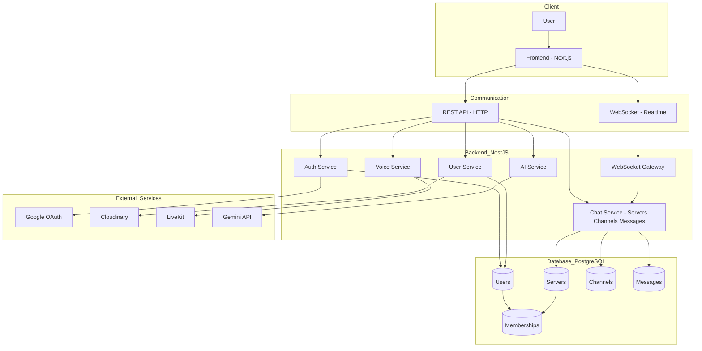

```mermaid

flowchart TB

%% CLIENT
subgraph Client
    A[User]
    B[Frontend - Next.js]
end

A --> B

%% COMMUNICATION
subgraph Communication
    C[REST API - HTTP]
    D[WebSocket - Realtime]
end

B --> C
B --> D

%% BACKEND
subgraph Backend_NestJS
    E[Auth Service]
    F[User Service]
    G[Chat Service - Servers Channels Messages]
    H[WebSocket Gateway]
    I[Voice Service]
    J[AI Service]
end

C --> E
C --> F
C --> G
C --> I
C --> J

D --> H
H --> G

%% DATABASE
subgraph Database_PostgreSQL
    K[(Users)]
    L[(Servers)]
    M[(Channels)]
    N[(Messages)]
    O[(Memberships)]
end

E --> K
F --> K
G --> L
G --> M
G --> N
K --> O
L --> O

%% EXTERNAL SERVICES
subgraph External_Services
    P[Google OAuth]
    Q[Cloudinary]
    R[LiveKit]
    S[Gemini API]
end

E --> P
F --> Q
I --> R
J --> S
```