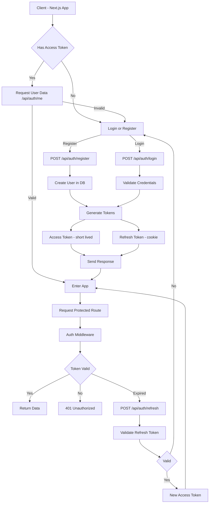

```mermaid
flowchart TD

%% CLIENT
A[Client - Next.js App]

A --> B{Has Access Token}

B -- No --> C[Login or Register]
B -- Yes --> D[Request User Data /api/auth/me]

D -->|Valid| E[Enter App]
D -->|Invalid| C

%% AUTH ACTIONS
C -->|Register| F[POST /api/auth/register]
C -->|Login| G[POST /api/auth/login]

F --> H[Create User in DB]
G --> I[Validate Credentials]

H --> J[Generate Tokens]
I --> J

J --> K[Access Token - short lived]
J --> L[Refresh Token - cookie]

K --> M[Send Response]
L --> M

M --> E

%% PROTECTED ROUTES
E --> N[Request Protected Route]

N --> O[Auth Middleware]
O --> P{Token Valid}

P -- Yes --> Q[Return Data]
P -- No --> R[401 Unauthorized]

%% REFRESH FLOW
P -- Expired --> S[POST /api/auth/refresh]

S --> T[Validate Refresh Token]

T --> U{Valid}

U -- Yes --> V[New Access Token]
U -- No --> C

V --> E
```