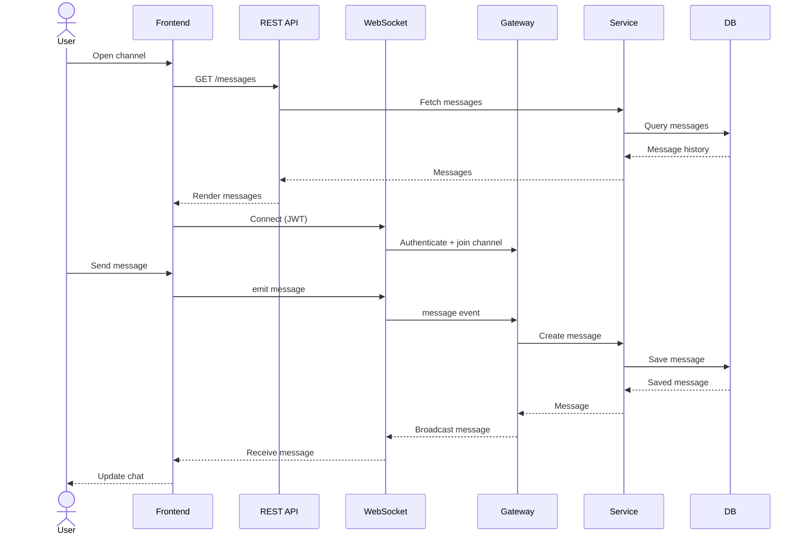

```mermaid
sequenceDiagram
    actor User
    participant UI as Frontend
    participant API as REST API
    participant WS as WebSocket
    participant Gateway
    participant Service
    participant DB

    %% INITIAL LOAD
    User->>UI: Open channel
    UI->>API: GET /messages
    API->>Service: Fetch messages
    Service->>DB: Query messages
    DB-->>Service: Message history
    Service-->>API: Messages
    API-->>UI: Render messages

    %% REAL-TIME CONNECTION
    UI->>WS: Connect (JWT)
    WS->>Gateway: Authenticate + join channel

    %% SEND MESSAGE
    User->>UI: Send message
    UI->>WS: emit message
    WS->>Gateway: message event
    Gateway->>Service: Create message
    Service->>DB: Save message
    DB-->>Service: Saved message
    Service-->>Gateway: Message

    %% BROADCAST
    Gateway-->>WS: Broadcast message
    WS-->>UI: Receive message
    UI-->>User: Update chat
```